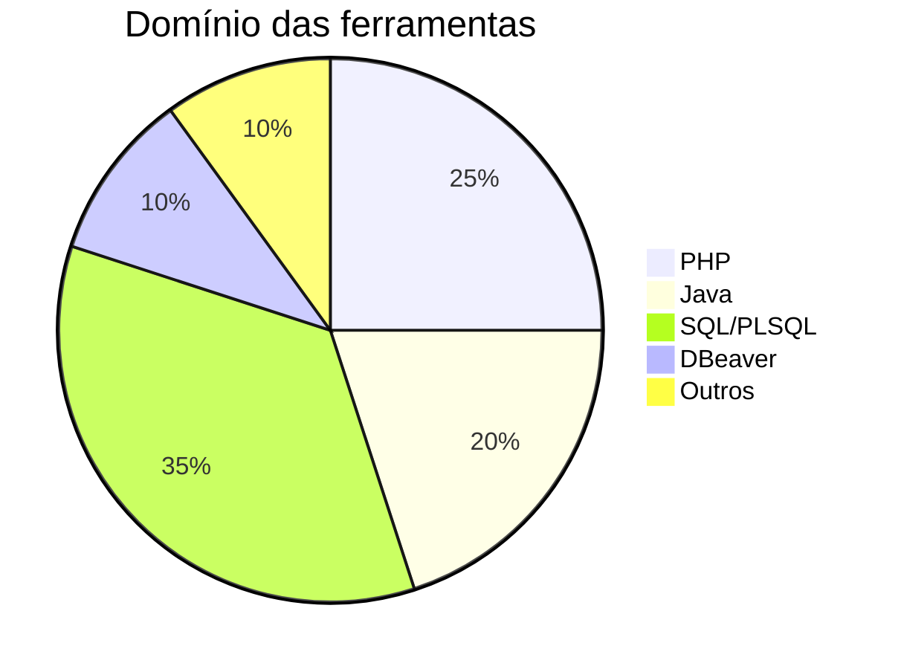

<h1 align="center">Vinícius Martins Cota</h1>
<h3 align="center">💻 Desenvolvedor Backend • PHP • Java • SQL • PL/SQL • DBeaver</h3>

  
  

---

## 🚀 Tecnologias que domino

<table>
  <tr>
    <td align="center"> PHP</td>
    <td align="center"> Java</td>
    <td align="center"> SQL</td>
    <td align="center"> PL/SQL</td>
    <td align="center"> DBeaver</td>
  </tr>
</table>

---

## 📌 Sobre mim

- 🧠 Apaixonado por **backend, dados e performance**
- 🧰 Especialista em **consultas otimizadas e modelagem de dados**
- 🛠️ Trabalho com **manutenção, criação e documentação de APIs**
- 📘 Foco em **limpeza de código e clareza estrutural**
- 📈 Sempre buscando **melhoria contínua e novos desafios**

---

## 📊 Nível de proficiência (autoavaliação)

---

## 📫 Contato

- GitHub: [github.com/viiniciusdev](https://github.com/viiniciusdev)
- LinkedIn: [linkedin.com/in/viníciusmartinscota](https://www.linkedin.com/in/viníciusmartinscota)

---

🧩 Simplicidade, performance e código limpo são minha base.

